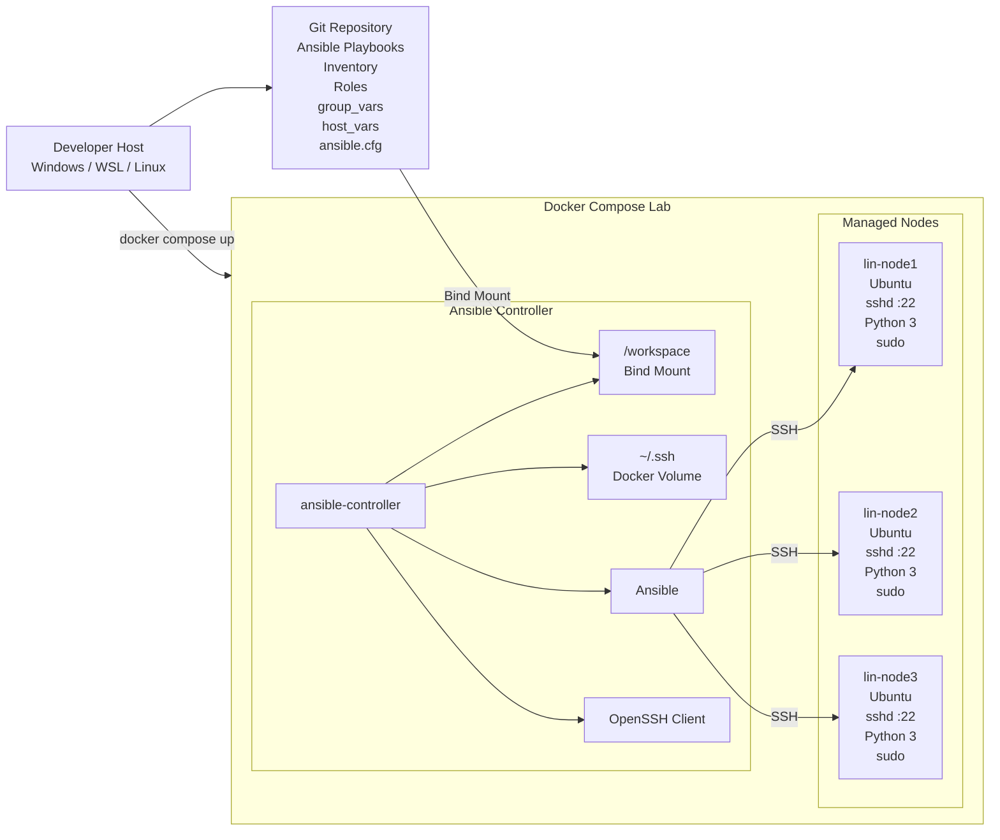
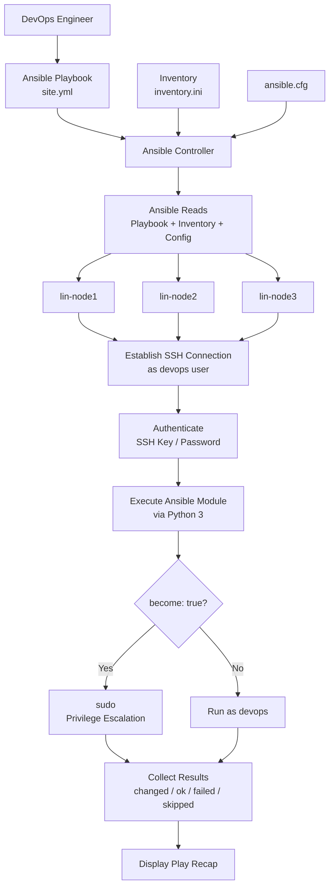
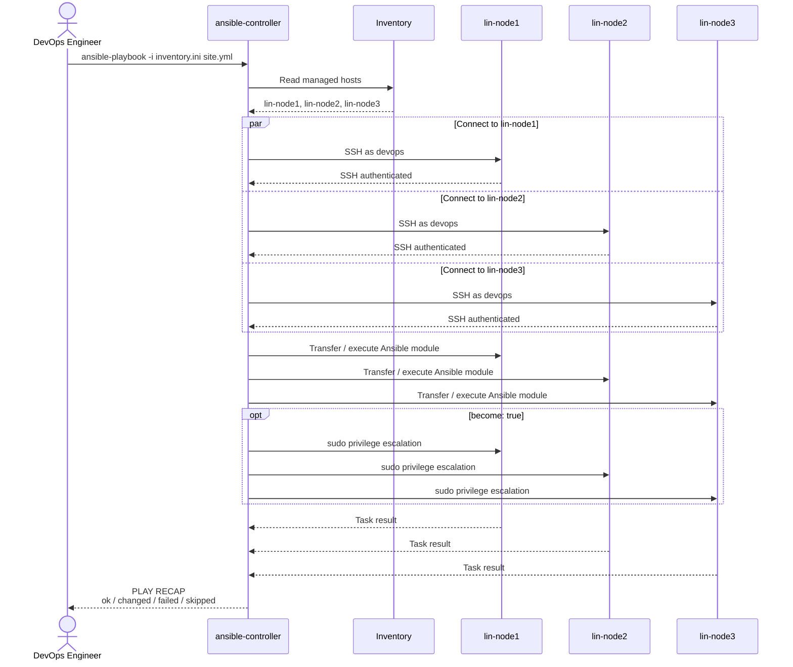

# Docker Compose Ansible Lab

A lightweight local Ansible learning environment built using Docker Compose.

The lab provides one dedicated **Ansible controller** and three disposable **Ubuntu managed nodes**. It is designed for practising Ansible concepts such as inventories, playbooks, roles, variables, SSH connectivity, privilege escalation, and multi-node configuration management without requiring multiple virtual machines.

The controller acts as the Ansible control node, while the Ubuntu containers simulate remote Linux servers managed over SSH.

---

## Project Overview

The environment consists of:

* `ansible-controller` — Ansible control node
* `lin-node1` — Ubuntu managed node
* `lin-node2` — Ubuntu managed node
* `lin-node3` — Ubuntu managed node

The Ansible controller contains the tools required to write and execute Ansible automation.

The managed nodes run an SSH server and provide Python and `sudo`, allowing Ansible modules and privilege escalation to operate similarly to a standard Linux server.

```text
Developer Host
      |
      |
      v
Docker Compose
      |
      +----------------------+
      |                      |
      v                      |
Ansible Controller           |
      |                      |
      | SSH                  |
      |                      |
      +----------+-----------+
                 |
       +---------+---------+
       |         |         |
       v         v         v
   lin-node1 lin-node2 lin-node3
```

---

## Goals

The purpose of this project is to provide a reusable Ansible lab for practising:

* Ansible inventories
* Playbooks and plays
* Tasks and modules
* Roles
* Handlers
* Variables
* `group_vars`
* `host_vars`
* SSH authentication
* Privilege escalation with `become`
* Multi-node configuration management
* Ansible troubleshooting
* Idempotency
* Linux automation

The managed nodes are intentionally disposable.

The Ansible configuration and controller SSH state are persisted independently from the managed containers.

---

## Architecture



### Architecture Flow

The project files remain on the developer host and are mounted into the Ansible controller at:

```text
/workspace
```

The controller uses SSH to connect to the managed nodes.

```text
Git / Host
    |
    |
    v
Ansible Project
    |
    | Bind Mount
    v
ansible-controller
    |
    | SSH
    |
    +-------------+-------------+
    |             |             |
    v             v             v
lin-node1      lin-node2      lin-node3
```

---

## Persistence Model

The project intentionally separates **persistent controller data** from **disposable managed nodes**.

```text
                        Git / Host
                            |
                            |
                     ansible-playbooks
                            |
                            v
                   ansible-controller
                   /workspace [MOUNTED]
                            |
                   ~/.ssh [VOLUME]
                            |
                           SSH
             +--------------+--------------+
             |              |              |
             v              v              v
         lin-node1       lin-node2       lin-node3
         disposable      disposable      disposable
```

The following data is persisted:

* Ansible playbooks
* Inventory
* `ansible.cfg`
* Roles
* `group_vars`
* `host_vars`
* Controller SSH keys
* Controller `known_hosts`

The managed nodes can be deleted and recreated without losing the Ansible project or controller SSH configuration.

---

## Ansible Execution Flow

When an Ansible playbook is executed, the controller reads the project configuration and determines which managed nodes should receive the tasks.



---

## Playbook Execution Sequence

For example:

```bash
ansible-playbook -i inventory.ini site.yml
```

The following sequence occurs:



At a high level:

```text
ansible-playbook
       |
       v
Read Playbook
       |
       v
Read Inventory
       |
       v
Determine Target Hosts
       |
       v
Connect via SSH
       |
       v
Execute Ansible Module
       |
       v
become: true?
   |         |
  Yes        No
   |         |
   v         v
 sudo      devops
   |         |
   +----+----+
        |
        v
 Collect Results
        |
        v
   PLAY RECAP
```

---

## Project Structure

A recommended project structure is:

```text
ansible-lab/
├── .env
├── compose.yaml
├── README.md
│
├── controller/
│   └── Dockerfile
│
├── managed-node/
│   └── Dockerfile
│
└── ansible-playbooks/
    ├── ansible.cfg
    ├── inventory.ini
    ├── site.yml
    │
    ├── group_vars/
    │   └── all.yml
    │
    ├── host_vars/
    │   ├── lin-node1.yml
    │   ├── lin-node2.yml
    │   └── lin-node3.yml
    │
    └── roles/
```

The `ansible-playbooks` directory is mounted into the controller:

```text
Host                            Controller

ansible-playbooks/   ------->   /workspace
```

Changes made to the Ansible files on the host are immediately available inside the controller container.

---

## Environment Variables

The project uses a `.env` file for lab configuration.

Example:

```env
DEVOPS_USER=devops
DEVOPS_PASSWORD=devops
UBUNTU_VERSION=22.04
```

Docker Compose passes these values to the Docker image builds as build arguments.

```text
.env
 |
 v
Docker Compose
 |
 v
build.args
 |
 v
Dockerfile ARG
 |
 v
Linux User Configuration
```

The credentials are intended for local lab use only.

Do not use the default lab credentials in production environments.

---

## Controller

The Ansible controller includes:

* Ansible
* Git
* OpenSSH client
* Python 3
* `sudo`
* `ping`
* Vim
* Nano
* Tree

The controller runs as the configured DevOps user.

Example:

```text
devops@ansible-controller:/workspace$
```

The `/workspace` directory contains the mounted Ansible project.

---

## Managed Nodes

Each managed node includes:

* OpenSSH server
* Python 3
* `sudo`
* CA certificates
* `iproute2`
* `ping`
* Process utilities

The SSH daemon listens on port `22`.

The configured DevOps user can authenticate over SSH and use `sudo`.

```text
Ansible Controller
       |
       | SSH :22
       v
Managed Node
       |
       v
devops user
       |
       | become: true
       v
sudo
       |
       v
root privileges
```

Ansible itself is not installed on the managed nodes.

Ansible runs on the controller and remotely executes modules on the managed systems.

---

## Start the Lab

Build and start the environment:

```bash
docker compose up -d --build
```

Check the containers:

```bash
docker compose ps
```

Expected services:

```text
ansible-controller
lin-node1
lin-node2
lin-node3
```

---

## Access the Ansible Controller

Open a shell inside the controller:

```bash
docker compose exec ansible-controller bash
```

You should enter the container as the DevOps user:

```text
devops@ansible-controller:/workspace$
```

---

## Verify Managed Nodes

From the controller, verify DNS resolution:

```bash
ping lin-node1
ping lin-node2
ping lin-node3
```

Test SSH connectivity:

```bash
ssh devops@lin-node1
```

The initial lab password is configured through:

```env
DEVOPS_PASSWORD=devops
```

---

## Generate Controller SSH Keys

Inside the Ansible controller:

```bash
ssh-keygen -t ed25519
```

The generated keys are stored under:

```text
/home/devops/.ssh
```

The SSH directory is persisted using a Docker volume.

This means the controller SSH keys remain available when the controller container is recreated.

---

## Test Ansible Connectivity

Example inventory:

```ini
[linux_nodes]
lin-node1
lin-node2
lin-node3

[linux_nodes:vars]
ansible_user=devops
```

Run an Ansible ping test:

```bash
ansible all -i inventory.ini -m ping
```

Expected output:

```text
lin-node1 | SUCCESS => {
    "ping": "pong"
}

lin-node2 | SUCCESS => {
    "ping": "pong"
}

lin-node3 | SUCCESS => {
    "ping": "pong"
}
```

---

## Example Playbook

Create a `site.yml` file:

```yaml
---
- name: Configure Linux managed nodes
  hosts: linux_nodes
  become: true

  tasks:
    - name: Install Nginx
      ansible.builtin.apt:
        name: nginx
        state: present
        update_cache: true
```

Run the playbook:

```bash
ansible-playbook -i inventory.ini site.yml
```

Ansible connects to all three nodes and applies the desired configuration.

---

## Stop the Lab

Stop the containers:

```bash
docker compose stop
```

Restart the lab:

```bash
docker compose start
```

---

## Recreate Managed Nodes

The managed nodes are disposable.

Remove the environment:

```bash
docker compose down
```

Recreate it:

```bash
docker compose up -d --build
```

The Ansible project remains on the host.

The controller SSH volume remains available unless Docker volumes are explicitly removed.

To remove the Docker volumes as well:

```bash
docker compose down -v
```

> Running `docker compose down -v` removes the persisted controller SSH volume.

---

## Lab Design Philosophy

This environment intentionally follows a control-node and managed-node model similar to a real Ansible environment.

```text
Production Concept             Lab Equivalent

Control Node            --->   ansible-controller
Linux Servers           --->   lin-node1..3
SSH                     --->   Docker network + SSH
Git Repository          --->   ansible-playbooks
Persistent Project      --->   Bind Mount
SSH Identity            --->   Docker Volume
Server Rebuild          --->   Container Recreation
```

The goal is not to perfectly simulate production infrastructure.

The goal is to provide a fast, reusable environment for understanding how Ansible communicates with and configures Linux systems.

---

## Technologies

* Docker
* Docker Compose
* Ubuntu
* Ansible
* OpenSSH
* Python
* Linux
* Git

---

## Future Lab Exercises

Possible exercises for this environment include:

* Configure SSH key authentication
* Disable password authentication
* Create users with Ansible
* Manage Linux packages
* Configure Nginx
* Deploy configuration files
* Use handlers to restart services
* Create reusable Ansible roles
* Configure `group_vars`
* Configure `host_vars`
* Use Ansible Vault
* Implement loops and conditionals
* Use templates with Jinja2
* Practise Ansible tags
* Test idempotency
* Simulate failed managed nodes
* Explore Ansible forks and parallel execution
* Use dynamic inventories
* Configure multiple Linux distributions

---

## Disclaimer

This project is intended for local development and learning purposes.

The credentials and SSH configuration used in this lab are intentionally simplified and should not be used as production security practices.
