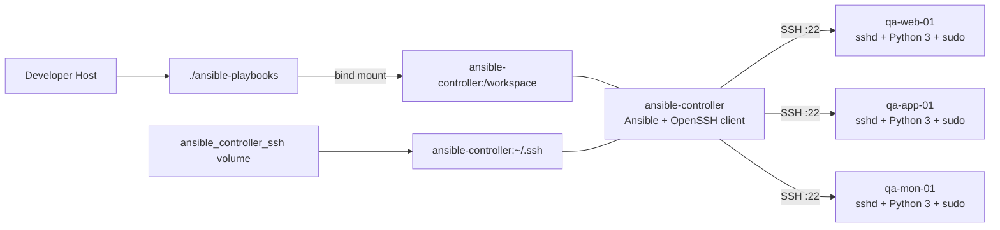

# Docker Compose Ansible Lab

A lightweight local Ansible learning environment built with Docker Compose. The lab provides one **Ansible controller** and three disposable **Ubuntu managed nodes** so you can practise inventories, playbooks, roles, variables, SSH authentication, and `become` without managing virtual machines.

## Architecture

* `ansible-controller` contains Ansible, Git, Python 3, an OpenSSH client, and common troubleshooting tools.
* `qa-web-01`, `qa-app-01`, and `qa-mon-01` run `sshd`, Python 3, and `sudo`.
* The Ansible project is bind-mounted from `./ansible-playbooks` into `/workspace` on the controller.
* The controller SSH directory is stored in the `ansible_controller_ssh` Docker volume.
* Managed nodes are disposable and keep no persistent lab state.

```text
Host / Git Repository
        |
        | bind mount: ./ansible-playbooks -> /workspace
        v
ansible-controller
    /workspace
    ~/.ssh [Docker volume]
        |
        | SSH over Docker network
        v
+-----------+-----------+-----------+
|           |           |           |
v           v           v
qa-web-01   qa-app-01   qa-mon-01
```



## Project Structure

```text
ansible-lab101/
├── .env.example
├── .gitignore
├── compose.yml
├── README.md
├── architecture-and-flow/
│   ├── archutecture.mermaid
│   ├── flow.mermaid
│   └── sequence.mermaid
├── controller/
│   ├── Dockerfile
│   └── bin/controller-entrypoint.sh
├── nodes/
│   └── Dockerfile
└── ansible-playbooks/
    ├── ansible.cfg
    ├── inventory.ini
    ├── site.yml
    ├── group_vars/all.yml
    ├── host_vars/qa-web-01.yml
    ├── host_vars/qa-app-01.yml
    ├── host_vars/qa-mon-01.yml
    └── roles/
```

## Environment Variables

Copy the example file and adjust values if desired:

```bash
cp .env.example .env
```

```env
DEVOPS_USER=devops
DEVOPS_PASSWORD=devops
UBUNTU_VERSION=22.04
```

Compose passes these values as Docker build arguments. The password is intentionally simple for a local learning lab. Do not copy this secret handling model into production: build arguments and lab passwords can appear in local image metadata/history and are not a production secret-management mechanism.

## Start the Lab

```bash
docker compose up -d --build
```

Check container state:

```bash
docker compose ps
```

Expected services are `ansible-controller`, `qa-web-01`, `qa-app-01`, and `qa-mon-01`. The node SSH ports are not published to the host because the controller reaches them by service name on the Docker network. Each node image uses a unique local tag so parallel Compose builds do not race while exporting the same image name.

## First-Time SSH Bootstrap

Enter the controller as the DevOps user:

```bash
docker compose exec --user devops ansible-controller bash
```

Generate a persistent SSH key if one does not already exist:

```bash
ssh-keygen -t ed25519 -f ~/.ssh/id_ed25519
```

Copy the public key to each disposable managed node. The initial password is `DEVOPS_PASSWORD` from `.env`:

```bash
for host in qa-web-01 qa-app-01 qa-mon-01; do
  ssh-copy-id "devops@${host}"
done
```

Test key authentication and accept/save host keys in the persistent `known_hosts` file:

```bash
for host in qa-web-01 qa-app-01 qa-mon-01; do
  ssh "devops@${host}" 'python3 --version && sudo -S -v'
done
```

The controller entrypoint repairs ownership and permissions on the mounted `~/.ssh` volume at startup. This avoids a common named-volume issue where a mount can hide image-built directory metadata or retain incorrect ownership from an earlier container.

## Ansible Usage

The repository includes a starter Ansible project in `ansible-playbooks/`. `group_vars/all.yml` derives `ansible_user` from the controller `DEVOPS_USER` environment variable and sets `/usr/bin/python3` as the remote interpreter.

Run an Ansible ping after SSH key bootstrap from inside `/workspace` on the controller:

```bash
ansible all -m ping
```

Run the example playbook, which verifies Python and sudo/become behavior:

```bash
ansible-playbook site.yml
```

The controller image sets `ANSIBLE_CONFIG=/workspace/ansible.cfg` and the startup entrypoint repairs `/workspace` permissions. This keeps Ansible using the lab inventory even when the bind mount is created with permissive host-side permissions.

`ansible.cfg` keeps host key checking enabled and prompts for the become password. This is intentional: the lab teaches explicit SSH trust and password-backed sudo rather than hiding those concepts with insecure defaults such as global host-key bypass or `NOPASSWD` sudo.

## Persistence and Disposal

Persisted:

* `ansible-playbooks/` on the host, mounted at `/workspace`
* Controller SSH keys and `known_hosts` in the `ansible_controller_ssh` Docker volume

Disposable:

* `qa-web-01`, `qa-app-01`, and `qa-mon-01` containers
* Managed-node SSH host keys and authorized keys

Stop/start containers without deleting them:

```bash
docker compose stop
docker compose start
```

Recreate containers while keeping the controller SSH volume:

```bash
docker compose down
docker compose up -d --build
```

Remove all lab containers and the persisted controller SSH volume:

```bash
docker compose down -v
```

> Warning: `docker compose down -v` deletes the persisted controller SSH keys and `known_hosts`.

## Security Notes

This is a local learning lab, not a production platform.

Acceptable local-lab simplifications:

* Password authentication is enabled on managed nodes for first-time key bootstrap.
* A simple DevOps password can be stored in local `.env`.
* Sudo requires the lab password and is granted through `/etc/sudoers.d/` for the configured user.

Do not copy to production:

* Building images with passwords as Docker build arguments.
* Enabling SSH password authentication broadly.
* Using shared, simple lab credentials.

Root SSH login is disabled on managed nodes, and node port `22` is only exposed inside the Docker network.

## Useful Commands

Validate Compose:

```bash
docker compose config
```

Build images:

```bash
docker compose build
```

Verify controller-to-node DNS from the controller:

```bash
for host in qa-web-01 qa-app-01 qa-mon-01; do getent hosts "$host"; done
```

Run a one-off password-based Ansible ping before SSH key bootstrap:

```bash
ansible all -m ping -e ansible_password=devops
```

Run the example playbook with explicit password variables for non-interactive testing:

```bash
ansible-playbook site.yml -e ansible_password=devops -e ansible_become_password=devops
```
